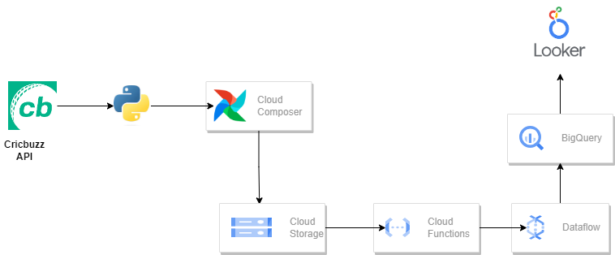

# Building a Cricket Statistics Pipeline with Google Cloud Services

In the world of data engineering, the journey from data retrieval to insightful visualization is an adventure filled with challenges and rewards. This project involves creation of a comprehensive cricket statistics pipeline using Google Cloud services. From retrieving data via the Cricbuzz API to Scheduling a job using Airflow, each phase contributes to the seamless flow of data for analysis.

### Architecture

### Data Retrieval with Python and Cricbuzz API
Fetch cricket statistics from the Cricbuzz API and use Python to gather the required data efficiently.

### Storing Data in Google Cloud Storage (GCS)
Once the data is obtained, next step involves preserving it securely in the cloud. Data is stored in a CSV format within Google Cloud Storage (GCS), ensuring accessibility and scalability for future processing.

### Creating a Cloud Function Trigger
Set up a Cloud Function that acts as the catalyst for  pipeline. This function triggers upon file upload to the GCS bucket, serving as the initiator for our subsequent data processing steps.

### Execution of the Cloud Function
Within the Cloud Function, intricate code is crafted to precisely trigger a Dataflow job. Handle triggers and pass the requisite parameters to seamlessly initiate the Dataflow job, ensuring a smooth flow of data processing.

### Dataflow Job for BigQuery
The core of pipeline lies in the Dataflow job. Triggered by the Cloud Function, this job orchestrates the transfer of data from the CSV file in GCS to BigQuery. Configure the job settings to ensure optimal performance and accurate data ingestion into BigQuery.

